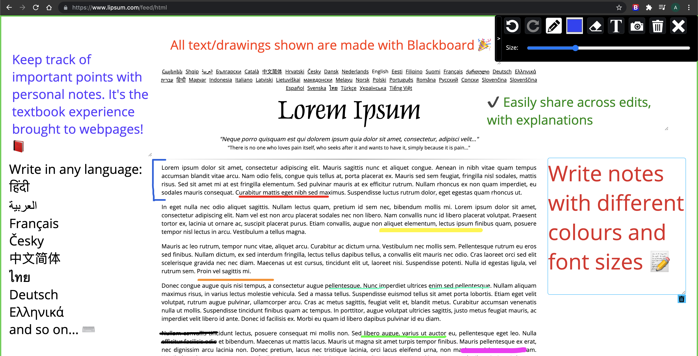
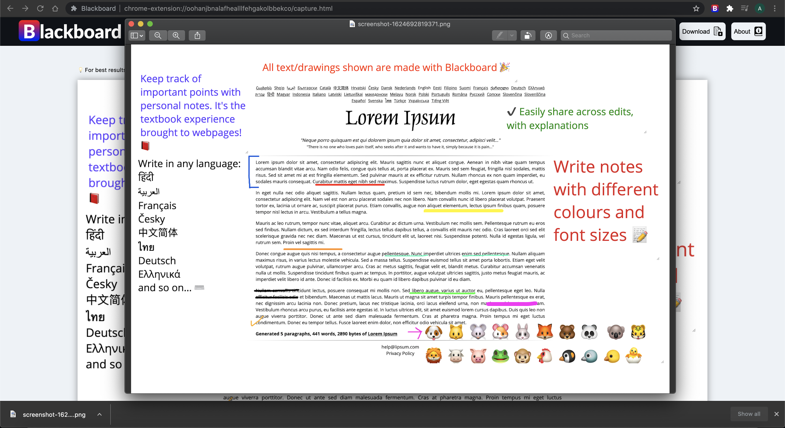

# Blackboard


## [Chrome extension](https://chrome.google.com/webstore/detail/blackboard/mjpaeljbciakgnigdligmdihfhnpbfla) to annotate webpages, capture and save full page screenshots 🚀

<br />


## Features
-   ✏️ Pencil tool
-   📷 Full page screenshot
-   ✨ Textbox
-   🎚️ Size adjustor for drawing/writing
-   ✨ Eraser tool
-   🎨 Colour Palette
-   🖌️ Colour Picker
-   📥 Download screenshot
-   🗑️ Reset

## Screenshots




## Installation
Clone repo

```
git clone https://github.com/AshreneRoy/blackboard.git
```
Go to `blackboard` directory run

```
npm install
```
Now build the extension using
```
npm run build
```
You will see a `build` folder generated inside `blackboard`

To avoid running `npm run build` after updating any file, you can run

```
npm run watch
```

which listens to any local file changes, and rebuilds automatically.

## Building
```
npm run build
```

## Adding Blackboard extension to Chrome
In Chrome browser, go to chrome://extensions page and switch on developer mode. This enables the ability to locally install a Chrome extension.

Now click on the `LOAD UNPACKED` and browse to `blackboard/build` .This will install the Blackboard as a Chrome extension.

## License
MIT
